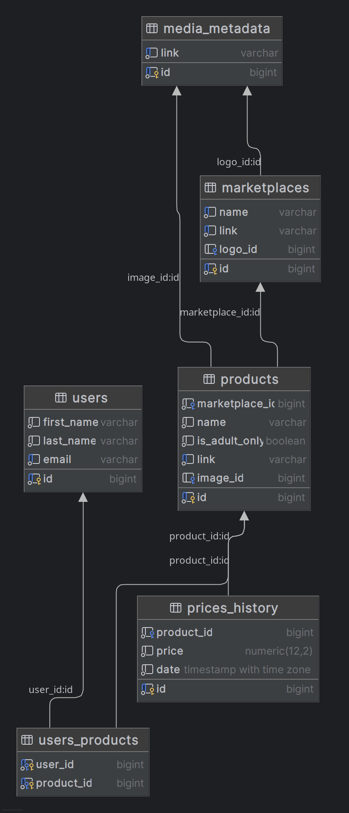

# База данных

Основная база данных, хранящая информацию о маркетплейсах, товарах, пользователях и так далее.

ER-диаграмма выглядит следующим образом:


1. В таблице `media_metadata` хранятся метаданные медиафайлов (ссылки на изображения товаров и так далее).
2. В таблице `marketplaces` хранится информация о маркетплейсах.
3. В таблице `products` хранится информация о товарах.
4. В таблице `prices_history` хранится история цен на товары.
5. В таблице `users` хранится информация о пользователях системы.
6. Таблица `users_products` связывает пользователей и товары отношением многие-ко-многим, тем самым храня отслеживаемые
   каждым конкретным пользователем товары.

## Использование

Для инициализации базы данных вручную нужно, находясь в корневой директории проекта, выполнить следующие шаги:

1. Запустить скрипт `init.sql` для инициализации базы банных:

```shell
sudo -u postgres psql -f sql/init.sql
```

2. Создать необходимые таблицы в проинициализированной базе данных, запустив скрипт `schema.sql`:

```shell
sudo -u postgres psql -d pseudo_discounts -f sql/schema.sql
```
